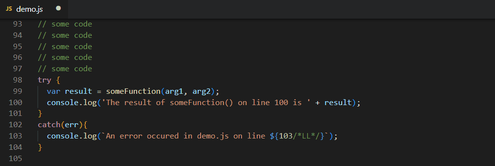
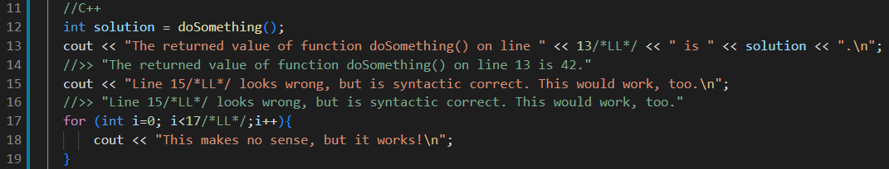
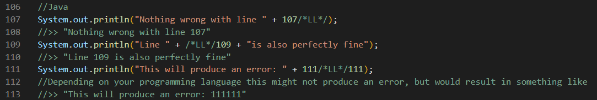

# line-logger README

An extension for Visual Studio Code which logs the line numbers next to specific tokens, so you can e.g. debug your code more efficiently.

## Content
[Supported Languages](#supported-languages) 
[Installation](#installation) 
[How It Works](#how-it-works) 
&nbsp;&nbsp;&nbsp;&nbsp;- [Tokens](#tokens) 
&nbsp;&nbsp;&nbsp;&nbsp;- [Line Numbers](#line-numbers) 
&nbsp;&nbsp;&nbsp;&nbsp;- [Commands](#commands) 
&nbsp;&nbsp;&nbsp;&nbsp;- [Things to keep in mind](#things-to-keep-in-mind) 
[Keybindings](#keybindings) 
[Known Issues](#known-issues) 
[Release Notes](#release-notes) 

## Supported Languages
The line-logger extension works with any programming language that allows multiline comments in one of the following formats: 
> `/* */`&nbsp;&nbsp;,&nbsp;&nbsp;`<!--  -->`&nbsp;&nbsp;,&nbsp;&nbsp;`(* *)`&nbsp;&nbsp;,&nbsp;&nbsp;`<# #>`&nbsp;&nbsp;,&nbsp;&nbsp;`{- -}`&nbsp;&nbsp;,&nbsp;&nbsp;`\* *\`&nbsp;&nbsp;,&nbsp;&nbsp;`%{ %}`&nbsp;&nbsp;or&nbsp;&nbsp;`--[[ ]]` 

This includes Java, Javascript, C, C++, C#, HTML, PHP, Matlab, ColdFusion, AppleScript, Pascal, PowerShell, D, Swift, Haskell, Lua, OCaml, and more

## Installation
Just install this extension from the VS Code marketplace. Afterwards you may need to restart VS Code. That's it.

## How It Works
You can place line-logger tokens anywhere in your code. Upon calling a log command (see [Commands](###commands)) from the Command Palette, this extension searches for the line-logger tokens in your code and hardcodes the corresponding line numbers right in front of (or right behind) the tokens. Existing line numbers will be updated during this process.  
There are also commands which let you automatically delete existing line numbers or erase all line-logger tokens from your code.

### Tokens
A line-logger token is basically just a multiline comment with nothing but `LL` in it. 
In e.g. Java, C or JavaScript a multiline comment is represented by the opening tag `/*` and the closing tag `*/` , hence a line-logger token would look like this: `/*LL*/` . 
In general, you can place line-logger tokens anywhere in your code. However, this extension doesn't check if your code is still correct, neither after you placed your tokens, nor after the line numbers are written, updated or deleted from your code. It's up to you to take care that the tokens are placed in a way so that the syntax of your code is still correct. 

### Line numbers
Any sequence of digits directly adjacent to a line-logger token is treated as a line number. Line numbers infront of the tokens start (line numbers behind the tokens end) at the next non digit character, including spaces and line breaks. 
Depending on your own preferences, line numbers can be stored on the left or on the right side of the tokens (see [Commands](###commands) below). If you switch between those two styles, it's advisable to delete the line numbers first (see [Commands](###commands) below) or you will probably end up with invalid code. 

### Commands
Hit CTRL + SHIFT + P to open the Command Palette and enter one of the commands below. 
Since the Command Palette uses a built in search function, you can simplify the commands by entering any parts of the words appearing in the commands, as long as they are in the same order. Because of this, you can e.g. just enter `>line-logger` and select one of the appearing commands, use the suggested short forms or make up your own short forms which don't collide with your other installed expansions.

>`>log line numbers to the left of the line-logger tokens`  &nbsp;&nbsp;&nbsp;&nbsp;(suggested short form: `>log left` &nbsp;&nbsp;&nbsp;or&nbsp;&nbsp;&nbsp; `>logle`) 
The line numbers will be written in front of the tokens. Already existing line numbers in front of the tokens will be updated. Line numbers behind the tokens won't be changed.

>`>log line numbers to the right of the line-logger tokens`  &nbsp;&nbsp;&nbsp;&nbsp;(suggested short form: `>log right` &nbsp;&nbsp;&nbsp;or&nbsp;&nbsp;&nbsp; `>logri`) 
The line numbers will be written behind the tokens. Already existing line numbers behind the tokens will be updated. Line numbers in front of the tokens won't be changed.

>`>delete line numbers adjacent on the left of line-logger tokens`  &nbsp;&nbsp;&nbsp;&nbsp;(suggested short form: `>delete left` &nbsp;&nbsp;&nbsp;or&nbsp;&nbsp;&nbsp; `>dle`) 
May existing line numbers in front of the tokens will be deleted.

>`>delete line numbers adjacent on the right of line-logger tokens`  &nbsp;&nbsp;&nbsp;&nbsp;(suggested short form: `>delete right` &nbsp;&nbsp;&nbsp;or&nbsp;&nbsp;&nbsp; `>dr`) 
May existing line numbers behind the tokens will be deleted.

>`>erase all line-logger tokens`  &nbsp;&nbsp;&nbsp;&nbsp;(suggested short form: `>erase tokens` &nbsp;&nbsp;&nbsp;or&nbsp;&nbsp;&nbsp; `>erto`) 
All line-logger tokens will be deleted from your file. This helps you to clean your code if you don't need the tokens anymore. You may want to run `>delete left` and/or `>delete right` first.

### Things to keep in mind
- Any of these commands alters your code, meaning the line numbers will be hardcoded into (or deleted from) your code. 
- Whenever you add or delete lines of code, some tokens may move to another line. Line numbers next to the tokens aren't updated until you run the log command again. 
- `>log left` updates numbers in front of the tokens, but doesnt alter numbers behind of the tokens. Vice versa for `>log right`. So if you change the prefered style from `>log left` to `>log right` (or vice versa), don't forget to run `>delete left` (or `>delete right`) once, or you'll probably end up with some errors. 
- You can always add new tokens. Just run a log command again. 
- You can always delete unwanted tokens manually. Don't forget to delete the corrosponding line number, too, if you don't want to keep it. 
- If you accidently run `>erase tokens`, you can always Edit-->Undo (CTRL + Z) the last step.

## Keybindings
There aren't any [keybindings](https://code.visualstudio.com/docs/getstarted/keybindings) implemented, but you can set your own bindings  via &nbsp;&nbsp; File --> Preferences --> Keyboard Shortcuts &nbsp;&nbsp; and entering 'line-logger' into the search bar. 
Choose the commands of your choice and assign them the bindings you'd like. 
See also [https://code.visualstudio.com/docs/getstarted/keybindings#_detecting-keybinding-conflicts](https://code.visualstudio.com/docs/getstarted/keybindings#_detecting-keybinding-conflicts) on how to avoid keybinding conflicts.

## Known Issues
see [https://www.github.com/Huegelkoenig/line-logger-VSCE/issues](https://www.github.com/Huegelkoenig/line-logger-VSCE/issues)

## Release Notes 
see [https://www.github.com/Huegelkoenig/line-logger-VSCE/blob/master/CHANGELOG.md](https://www.github.com/Huegelkoenig/line-logger-VSCE/blob/master/CHANGELOG.md)
